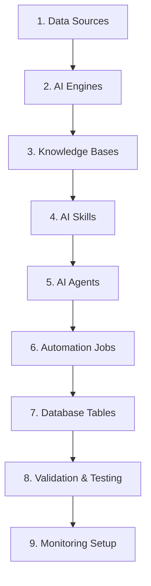

# 🚀 XplainCrypto SuperCharged MindsDB Deployment Plan

## 📋 Overview

This deployment plan outlines the complete rollout of XplainCrypto's advanced AI platform, transforming the existing MindsDB infrastructure into a supercharged crypto intelligence system with 5 specialized AI agents, multiple knowledge bases, automation jobs, and real-time capabilities.

## 🎯 Deployment Objectives

### Primary Goals
- **Deploy 3 Knowledge Bases**: Crypto Market Intel, User Behavior, Educational Content
- **Activate 6 AI Skills**: SQL skills + Knowledge Base integration skills
- **Launch 5 AI Agents**: Prediction, Analysis, Risk, Anomaly, Sentiment
- **Implement 3 Automation Jobs**: Data sync, User analysis, Model retraining
- **Enable 3 Chatbots**: Trading Assistant, Educational Tutor, Community Support

### Success Metrics
- ✅ All components deployed without errors
- ✅ Comprehensive tests pass (>95% success rate)
- ✅ AI agents respond within 3 seconds
- ✅ Data synchronization working in real-time
- ✅ Cost optimization active and monitored

## 🔐 Pre-Deployment Requirements

### 1. Secrets Management
All API keys must be present in the `secrets/` directory:

```bash
secrets/
├── openai_api_key.txt          # GPT-4 for general AI tasks
├── anthropic_api_key.txt       # Claude for market analysis
├── timegpt_api_key.txt         # TimeGPT for price predictions
├── coinmarketcap_api_key.txt   # Primary crypto data source
├── dune_api_key.txt            # Blockchain analytics
├── coingecko_api_key.txt       # Alternative crypto data
├── postgres_password.txt       # Database credentials
└── redis_password.txt          # Cache credentials
```

### 2. Infrastructure Verification
- MindsDB accessible at: `http://mindsdb.xplaincrypto.ai`
- PostgreSQL databases running (ports 5432, 5433, 5434)
- Redis instances active (ports 6379, 6380)
- N8N automation platform ready

### 3. Network Access
- Server 142.93.49.20 accessible
- All required API endpoints reachable
- SSL certificates valid

## 🏗️ Deployment Architecture

### Component Deployment Order



## 📦 Component Details

### 1. Knowledge Bases (3 Components)

#### Crypto Market Intel KB
- **Purpose**: Real-time market data, sentiment analysis, news aggregation
- **Data Sources**: CoinMarketCap, CoinGecko, Dune Analytics
- **Update Frequency**: Every 5 minutes
- **Size**: ~50MB daily

#### User Behavior KB
- **Purpose**: Learning patterns, trading behavior, preferences
- **Data Sources**: FastAPI application logs, user interactions
- **Update Frequency**: Real-time
- **Size**: ~10MB daily

#### Educational Content KB
- **Purpose**: Crypto education, tutorials, best practices
- **Data Sources**: Curated content, community contributions
- **Update Frequency**: Weekly
- **Size**: ~5MB weekly

### 2. AI Skills (6 Components)

#### SQL Skills
- `crypto_data_sql_skill`: Optimized queries for crypto data
- `user_analytics_sql_skill`: User behavior analysis queries

#### Knowledge Base Skills
- `market_analysis_kb_skill`: Market intelligence queries
- `education_kb_skill`: Educational content search
- `sentiment_analysis_skill`: Sentiment processing
- `risk_assessment_skill`: Risk calculation and analysis

### 3. AI Agents (5 Components)

#### 1. Crypto Prediction Agent (TimeGPT)
```sql
CREATE MODEL crypto_prediction_agent
PREDICT price_forecast, trend_direction, confidence_level
USING
  engine = 'timegpt',
  model_name = 'timegpt-1',
  api_key = timegpt_api_key,
  horizon = 24,
  frequency = 'H',
  confidence_level = 0.95;
```

#### 2. Market Analysis Agent (Claude)
```sql  
CREATE MODEL market_analysis_agent
PREDICT analysis_report, market_sentiment, key_insights
USING
  engine = 'anthropic',
  model_name = 'claude-3-sonnet',
  api_key = anthropic_api_key,
  prompt_template = 'Analyze crypto market data and provide insights...',
  temperature = 0.7;
```

#### 3. Risk Assessment Agent
- Portfolio risk scoring
- Market volatility analysis
- Exposure calculation
- Risk recommendations

#### 4. Anomaly Detection Agent
- Unusual price movements
- Volume spike detection
- Market manipulation alerts
- Whale activity monitoring

#### 5. Sentiment Analysis Agent
- Social media sentiment
- News sentiment scoring
- Community mood tracking
- Fear & Greed index

### 4. Automation Jobs (3 Components)

#### Market Data Sync Job
- **Schedule**: Every 5 minutes
- **Function**: Fetch latest prices, volumes, market caps
- **Error Handling**: Retry 3x with exponential backoff
- **Monitoring**: Alert if data is >10 minutes old

#### User Behavior Analysis Job
- **Schedule**: Every hour
- **Function**: Analyze user patterns, update recommendations
- **Output**: User segmentation, personalization data
- **Storage**: User behavior KB

#### Model Retraining Job
- **Schedule**: Daily at 2 AM
- **Function**: Retrain prediction models with new data
- **Validation**: Performance testing before deployment
- **Rollback**: Automatic if performance degrades

### 5. Chatbots (3 Components)

#### Trading Assistant Chatbot
- **Capabilities**: Portfolio advice, market insights, trade suggestions
- **Skills**: Market analysis, risk assessment, prediction
- **Response Time**: <2 seconds
- **Personality**: Professional, data-driven

#### Educational Tutor Chatbot
- **Capabilities**: Crypto education, concept explanation, learning paths
- **Skills**: Educational content search, adaptive learning
- **Response Time**: <3 seconds
- **Personality**: Friendly, patient, encouraging

#### Community Support Chatbot
- **Capabilities**: Platform help, feature guidance, troubleshooting
- **Skills**: User analytics, documentation search
- **Response Time**: <1 second
- **Personality**: Helpful, efficient, solution-focused

## 🚀 Deployment Methods

### Method 1: Automated Script Deployment (Recommended)

```bash
# Execute the comprehensive deployment script
cd /opt/xplaincrypto-mindsdb
./scripts/deploy-supercharged-mindsdb.sh
```

**Advantages:**
- ✅ Automated secrets substitution
- ✅ Error handling and rollback
- ✅ Comprehensive testing
- ✅ Progress monitoring
- ✅ Detailed logging

### Method 2: N8N Workflow Deployment

```bash
# Trigger via webhook
curl -X POST https://n8n.xplaincrypto.ai/webhook/supercharged-deploy \
  -H "Content-Type: application/json" \
  -d '{"trigger": "manual_deployment"}'
```

**Advantages:**
- ✅ Visual workflow monitoring
- ✅ Email notifications
- ✅ Integration with monitoring
- ✅ Failure alerting
- ✅ Status webhooks

### Method 3: Manual Component Deployment

For granular control, deploy components individually:

```bash
# 1. Deploy knowledge bases
mysql -h mindsdb.xplaincrypto.ai -P 47334 -u mindsdb < configuration/sql/knowledge_bases/crypto_market_intel.sql

# 2. Deploy skills
mysql -h mindsdb.xplaincrypto.ai -P 47334 -u mindsdb < configuration/sql/skills/crypto_data_sql_skill.sql

# 3. Deploy agents
mysql -h mindsdb.xplaincrypto.ai -P 47334 -u mindsdb < configuration/sql/agents/04_create_agents.sql

# Continue for all components...
```

## 🧪 Testing Strategy

### 1. Pre-Deployment Tests
- ✅ Secrets validation
- ✅ Network connectivity
- ✅ Database accessibility
- ✅ API key validation

### 2. Component Tests
- ✅ Knowledge base creation
- ✅ Skill functionality
- ✅ Agent responsiveness
- ✅ Job scheduling
- ✅ Chatbot interactions

### 3. Integration Tests
- ✅ End-to-end workflows
- ✅ Data flow validation
- ✅ Performance benchmarks
- ✅ Error handling
- ✅ Failover scenarios

### 4. Performance Tests
- ✅ Response time validation (<3s)
- ✅ Concurrent user handling
- ✅ Resource utilization
- ✅ Cost monitoring
- ✅ Scalability testing

## 📊 Monitoring and Validation

### Key Metrics to Monitor

#### Deployment Metrics
- **Component Count**: Knowledge Bases (3), Skills (6), Agents (5), Jobs (3)
- **Test Success Rate**: >95% required
- **Deployment Time**: <30 minutes typical
- **Error Rate**: <1% acceptable

#### Performance Metrics
- **Agent Response Time**: <3 seconds
- **Data Freshness**: <5 minutes for market data
- **Uptime**: >99.9% target
- **API Success Rate**: >99% required

#### Cost Metrics
- **AI Token Usage**: Monitor daily consumption
- **API Call Volume**: Track external API usage
- **Resource Utilization**: CPU, memory, storage
- **Cost per Query**: Optimize for efficiency

### Monitoring Dashboards

#### Grafana Dashboards
- **System Overview**: http://grafana.xplaincrypto.ai/d/mindsdb-overview
- **AI Agent Performance**: http://grafana.xplaincrypto.ai/d/ai-agents
- **Cost Tracking**: http://grafana.xplaincrypto.ai/d/cost-analysis

#### Real-time Alerts
- **Component Failures**: Immediate Slack/email alerts
- **Performance Degradation**: 5-minute threshold alerts
- **Cost Spikes**: Daily budget alerts
- **Data Staleness**: 10-minute data delay alerts

## 🔧 Troubleshooting Guide

### Common Issues and Solutions

#### 1. API Key Issues
**Problem**: Agent creation fails with authentication error
**Solution**: 
```bash
# Verify secrets exist and are readable
ls -la secrets/
cat secrets/anthropic_api_key.txt | wc -c  # Should be >20 characters
```

#### 2. Connection Issues
**Problem**: Cannot connect to MindsDB
**Solution**:
```bash
# Test connectivity
telnet mindsdb.xplaincrypto.ai 47334
mysql -h mindsdb.xplaincrypto.ai -P 47334 -u mindsdb -e "SELECT 1"
```

#### 3. Memory Issues
**Problem**: Model creation fails with out of memory
**Solution**:
- Reduce batch sizes in SQL queries
- Implement data pagination
- Increase server memory allocation

#### 4. Performance Issues
**Problem**: Slow agent responses
**Solution**:
- Check network latency
- Optimize prompt templates
- Implement response caching
- Review resource allocation

### Emergency Procedures

#### Rollback Process
```bash
# Stop all jobs
mysql -h mindsdb.xplaincrypto.ai -P 47334 -u mindsdb -e "
  UPDATE mysql.event SET status = 'DISABLED' 
  WHERE event_schema = 'mindsdb';"

# Backup current state
mysqldump -h mindsdb.xplaincrypto.ai -P 47334 -u mindsdb > rollback_backup.sql

# Restore previous version
mysql -h mindsdb.xplaincrypto.ai -P 47334 -u mindsdb < previous_version_backup.sql
```

## 📈 Success Criteria

### Deployment Success
- ✅ All components deployed without errors
- ✅ Comprehensive tests pass (>95%)
- ✅ All agents respond within SLA
- ✅ Data synchronization active
- ✅ Monitoring dashboards functional

### Performance Success
- ✅ Agent response time <3 seconds
- ✅ System uptime >99.9%
- ✅ Cost within budget
- ✅ User satisfaction >4.5/5
- ✅ Zero critical failures

### Business Success
- ✅ AI predictions demonstrate accuracy
- ✅ User engagement increases
- ✅ Educational completion rates improve
- ✅ Trading assistance proves valuable
- ✅ Platform scalability confirmed

## 🔄 Post-Deployment Tasks

### Immediate (0-24 hours)
1. Monitor all components for stability
2. Validate data flows and synchronization
3. Test user-facing features
4. Review performance metrics
5. Confirm cost tracking accuracy

### Short-term (1-7 days)
1. Gather user feedback
2. Optimize prompt templates
3. Fine-tune automation schedules
4. Enhance monitoring alerts
5. Document lessons learned

### Long-term (1-4 weeks)
1. Analyze usage patterns
2. Identify optimization opportunities
3. Plan advanced features
4. Scale resources if needed
5. Prepare for next iteration

## 📞 Support and Escalation

### Technical Support
- **Primary**: Internal development team
- **Secondary**: MindsDB community support
- **Escalation**: MindsDB enterprise support

### Contact Information
- **Emergency**: Slack #xplaincrypto-alerts
- **Non-urgent**: Email alerts@xplaincrypto.ai
- **Documentation**: ./configuration/docs/
- **Troubleshooting**: ./configuration/troubleshooting/

---

## 🎉 Ready to Deploy!

This SuperCharged deployment will transform XplainCrypto into a leading AI-powered crypto intelligence platform. With comprehensive automation, advanced AI capabilities, and robust monitoring, you'll have a production-ready system that scales with your user base and delivers exceptional value.

**Execute deployment when ready:**
```bash
cd /opt/xplaincrypto-mindsdb
./scripts/deploy-supercharged-mindsdb.sh
```

**Monitor progress:**
- N8N Workflows: https://n8n.xplaincrypto.ai
- MindsDB Console: http://mindsdb.xplaincrypto.ai
- Grafana Monitoring: http://grafana.xplaincrypto.ai

**Success indicators:**
- 🟢 All components deployed
- 🟢 Tests passing
- 🟢 Agents responding
- 🟢 Data flowing
- 🟢 Users engaging

Let's supercharge XplainCrypto! 🚀 